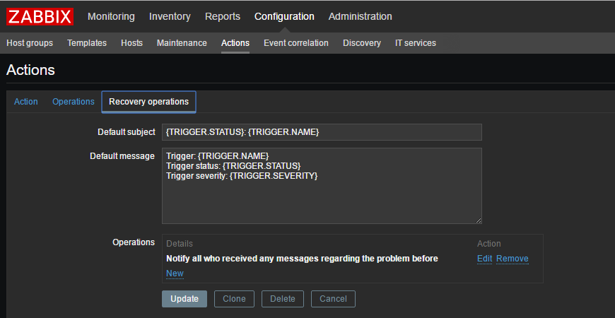

# zabbix-alert-email
### zabbix 设置
1. zabbix设置报警脚本存放位置
```bash
mkdir /etc/zabbix/zabbix_alert

vim /etc/zabbix/zabbix_server.conf
AlertScriptsPath=/etc/zabbix/zabbix_alert

systemctl restart zabbix-server
```

2. 下载邮件脚本
```bash
git clone https://github.com/smallasa/zabbix-alert-email.git
cp zabbix-alert-email/sendmail.py /etc/zabbix/zabbix_alert
chmod +x /etc/zabbix/zabbix_alert/sendmail.py
```

3. 添加示警媒介
```text
Administration --> Media types --> create media types
```


5. 为用户添加示警媒介
```text
Administration --> Users --> User group --> Create user
```


6. 设置Action
```text
Configuration --> Actions --> Event Sources(Triggers) --> Create Action
```



